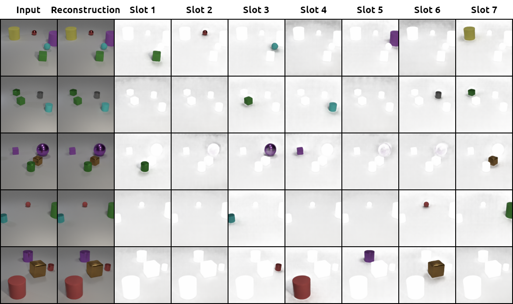
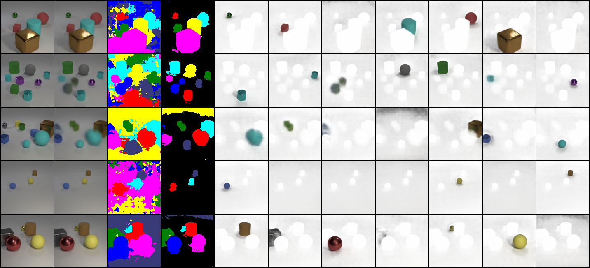
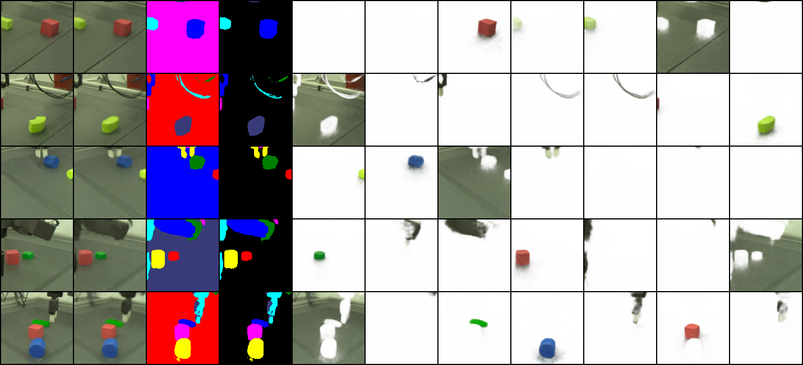
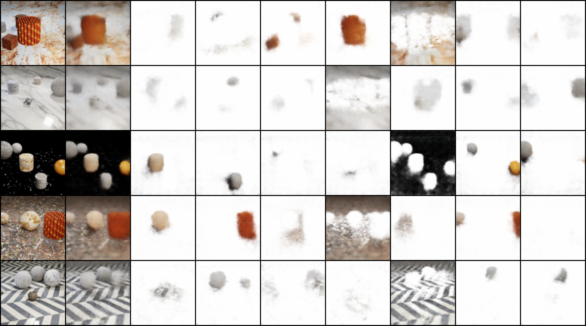
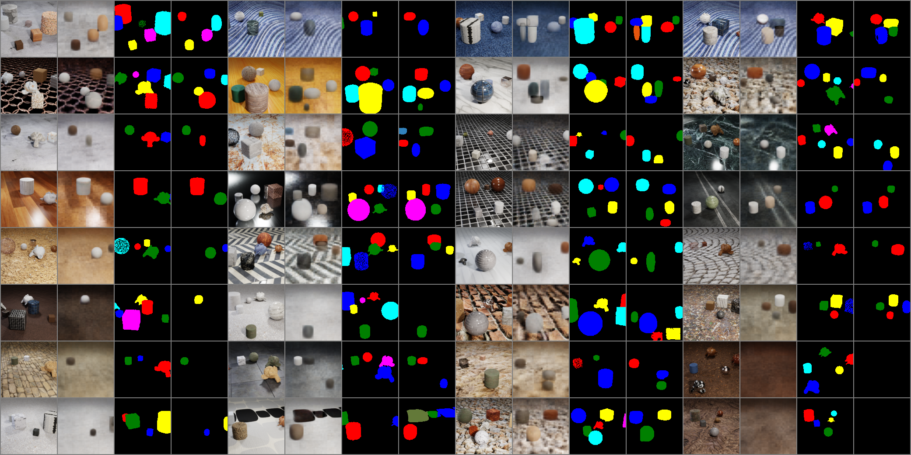
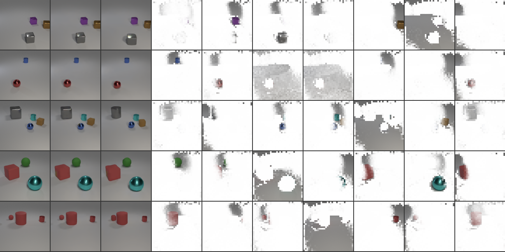
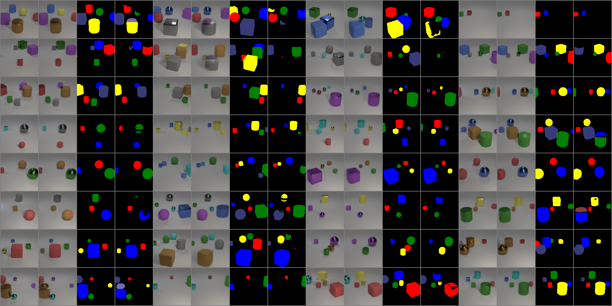

# Object Discovery PyTorch

> This is an implementation of several unsupervised object discovery models (Slot Attention, SLATE, GNM) in PyTorch.

    

**This repo is in active development. Expect some breaking changes.**

The initial code for this repo was forked from [untitled-ai/slot_attention](https://github.com/untitled-ai/slot_attention).

## Setup

### Requirements

- [Poetry](https://python-poetry.org/docs/)
- Python >= 3.9
- CUDA enabled computing device

### Getting Started

1. Clone the repo: `git clone https://github.com/HHousen/slot-attention-pytorch/ && cd slot-attention-pytorch`.
2. Install requirements and activate environment: `poetry install` then `poetry shell`.
3. Download the [CLEVR (with masks)](https://drive.google.com/uc?export=download&id=15FhXv-1x8T68ZFohOLyohyZgpGfMKmEO) dataset (or the original [CLEVR](https://cs.stanford.edu/people/jcjohns/clevr/) dataset by running `./data_scripts/download_clevr.sh /tmp/CLEVR`). More details about the datasets are below.
4. Modify the hyperparameters in [object_discovery/params.py](object_discovery/params.py) to fit your needs. Make sure to change `data_root` to the location of your dataset.
5. Train a model: `python -m slot_attention.train`.

## Pre-trained Models

Code to load these models can be adapted from [predict.py](./predict.py).

| Model | Dataset | Download |
|---|---|---|
| Slot Attention | CLEVR6 Masks | [Google Drive](https://drive.google.com/uc?id=1cON-ULNGGDdx1ApmIoGdF2bD9oXVwUXe) |
| Slot Attention | Sketchy | [Google Drive](https://drive.google.com/uc?id=1tCEMbVE2ByDXsncZ6Htkzzw1FKcIvcCr) |
| GNM | CLEVR6 Masks | [Google Drive](https://drive.google.com/uc?id=12-og3vLFrELm-cSJfPRn3tqXGJrErFk1) |
| Slot Attention | ClevrTex6 | [Google Drive](https://drive.google.com/uc?id=1Hh_wIkNMym_skm0yprmxb7v-VODuaHIk) |
| GNM | ClevrTex6 | [Google Drive](https://drive.google.com/uc?id=1VTIMJe-xCH_9RdE4qX4mjAq6mK35hDiX) |
| SLATE | CLEVR6 Masks | [Google Drive](https://drive.google.com/uc?id=13a9tyGQ4jeb3zwFo_hyM-auL9CQpvK31) |

## Usage

Train a model by running `python -m slot_attention.train`.

Hyperparameters can be changed in [object_discovery/params.py](object_discovery/params.py). `training_params` has global parameters that apply to all model types. These parameters can be overridden if the same key is present in `slot_attention_params` or `slate_params`. Change the global parameter `model_type` to `sa` to use Slot Attention (`SlotAttentionModel` in slot_attention_model.py) or `slate` to use SLATE (`SLATE` in slate_model.py). This will determine which model's set of parameters will be merged with `training_params`.

Perform inference by modifying and running the [predict.py](./predict.py) script.

### Models

Our implementations are based on several open-source repositories.

1. Slot Attention (["Object-Centric Learning with Slot Attention"](https://arxiv.org/abs/2006.15055)): [untitled-ai/slot_attention](https://github.com/untitled-ai/slot_attention) & [Official](https://github.com/google-research/google-research/tree/master/slot_attention)
2. SLATE (["Illiterate DALL-E Learns to Compose"](https://arxiv.org/abs/2110.11405)): [Official](https://github.com/singhgautam/slate)
3. GNM (["Generative Neurosymbolic Machines"](https://arxiv.org/abs/2010.12152)): [karazijal/clevrtex](https://github.com/karazijal/clevrtex) & [Official](https://github.com/JindongJiang/GNM)

### Datasets

Select a dataset by changing the `dataset` parameter in [object_discovery/params.py](object_discovery/params.py) to the name of the dataset: `clevr`, `shapes3d`, or `ravens`. Then, set the `data_root` parameter to the location of the data. The code for loading supported datasets is in [object_discovery/data.py](object_discovery/data.py).

1. [CLEVR](https://cs.stanford.edu/people/jcjohns/clevr/): Download by executing [download_clevr.sh](./data_scripts/download_clevr.sh).
2. [CLEVR (with masks)](https://github.com/deepmind/multi_object_datasets#clevr-with-masks): [Original TFRecords Download](https://console.cloud.google.com/storage/browser/multi-object-datasets/clevr_with_masks) / [Our HDF5 PyTorch Version](https://drive.google.com/uc?export=download&id=15FhXv-1x8T68ZFohOLyohyZgpGfMKmEO).
    - This dataset is a regenerated version of CLEVR but with ground-truth segmentation masks. This enables the training script to calculate Adjusted Rand Index (ARI) during validation runs.
    - The dataset contains 100,000 images with a resolution of 240x320 pixels. The dataloader splits them 70K train, 15K validation, 15k test. Test images are not used by the [object_discovery/train.py](object_discovery/train.py) script.
    - We convert the original TFRecords dataset to HDF5 for easy use with PyTorch. This was done using the [data_scripts/preprocess_clevr_with_masks.py](./data_scripts/preprocess_clevr_with_masks.py) script, which takes approximately 2 hours to execute depending on your machine.
3. [3D Shapes](https://github.com/deepmind/3d-shapes): [Official Google Cloud Bucket](https://console.cloud.google.com/storage/browser/3d-shapes)
4. RAVENS Robot Data: [Official Train](https://drive.google.com/uc?export=download&id=1JxNgM2ubU4zJU_GjnoIOtqFKd-Mg_kzh) & [Official Test](https://drive.google.com/uc?export=download&id=1Zq77Ox5GiW3LZlBdVGgfrDuegcyZtzdW)
    - We generated a dataset similar in structure to CLEVR (with masks) but of robotic images using [RAVENS](https://github.com/google-research/ravens). Our modified version of RAVENS used to generate the dataset is [HHousen/ravens](https://github.com/HHousen/ravens).
    - The dataset contains 85,002 images split 70,002 train and 15K validation/test.
5. Sketchy: Download and process by following directions in [applied-ai-lab/genesis](https://github.com/applied-ai-lab/genesis#sketchy) / [Download Our Processed Version](https://drive.google.com/uc?export=download&id=1VM2-8R9zuVnbre1jb9jzz6amO0T6dQVX)
    - Dataset details are in the paper [Scaling data-driven robotics with reward sketching and batch reinforcement learning](https://arxiv.org/abs/1909.12200).
6. ClevrTex: Download by executing [download_clevrtex.sh](./data_scripts/download_clevrtex.sh). Our dataloader needs to index the entire dataset before training can begin. This can take around 2 hours. Thus, it is recommended to download our pre-made index from [this Google Drive folder](https://drive.google.com/drive/folders/1qvkR6tHwGMZ4oyiEubokXioODqZAmRob) and put it in `./data/cache/`.
7. [Tetrominoes](https://github.com/deepmind/multi_object_datasets#tetrominoes): [Original TFRecords Download](https://console.cloud.google.com/storage/browser/multi-object-datasets/tetrominoes) / [Our HDF5 PyTorch Version](https://drive.google.com/uc?export=download&id=14eZKOsYLBDx_JuJlE7ZvQBTbESSc0Afh).
    - There are 1,000,000 samples in the dataset. However, following [the Slot Attention paper](https://arxiv.org/abs/2006.15055), we only use the first 60K samples for training.
    - We convert the original TFRecords dataset to HDF5 for easy use with PyTorch. This was done using the [data_scripts/preprocess_tetrominoes.py](./data_scripts/preprocess_tetrominoes.py) script, which takes approximately 2 hours to execute depending on your machine.

### Logging

To log outputs to [wandb](https://wandb.ai/home), run `wandb login YOUR_API_KEY` and set `is_logging_enabled=True` in `SlotAttentionParams`.

If you use a dataset with ground-truth segmentation masks, then the Adjusted Rand Index (ARI), a clustering similarity score, will be logged for each validation loop. We convert the implementation from [deepmind/multi_object_datasets](https://github.com/deepmind/multi_object_datasets) to PyTorch in [object_discovery/segmentation_metrics.py](object_discovery/segmentation_metrics.py).

## More Visualizations

Slot Attention CLEVR10 | Slot Attention Sketchy
:-----------------------:|:--------------------:
 | 

Visualizations (above) for a model trained on CLEVR6 predicting on CLEVR10 (with no increase in number of slots) and a model trained and predicting on Sketchy. The order from left to right of the images is original, reconstruction, raw predicted segmentation mask, processed segmentation mask, and then the slots.

Slot Attention ClevrTex6 | GNM ClevrTex6
:-----------------------:|:--------------------:
 | 

The Slot Attention visualization image order is the same as in the above visualizations. For GNM, the order is original, reconstruction, ground truth segmentation mask, prediction segmentation mask (repeated 4 times).

SLATE CLEVR6 | GNM CLEVR6
:-----------------------:|:--------------------:
 | 

For SLATE, the image order is original, dVAE reconstruction, autoregressive reconstruction, and then the pixels each slot pays attention to.

## References

1. [untitled-ai/slot_attention](https://github.com/untitled-ai/slot_attention): An unofficial implementation of Slot Attention from which this repo was forked.
2. Slot Attention: [Official Code](https://github.com/google-research/google-research/tree/master/slot_attention) / ["Object-Centric Learning with Slot Attention"](https://arxiv.org/abs/2006.15055).
3. SLATE: [Official Code](https://github.com/singhgautam/slate) / ["Illiterate DALL-E Learns to Compose"](https://arxiv.org/abs/2110.11405).
4. IODINE: [Official Code](https://github.com/deepmind/deepmind-research/tree/master/iodine) / ["Multi-Object Representation Learning with Iterative Variational Inference"](https://arxiv.org/abs/1903.00450). In the Slot Attention paper, IODINE was frequently used for comparison. The IODINE code was helpful to create this repo.
5. Multi-Object Datasets: [deepmind/multi_object_datasets](https://github.com/deepmind/multi_object_datasets). This is the original source of the [CLEVR (with masks)](https://github.com/deepmind/multi_object_datasets#clevr-with-masks) dataset.
6. Implicit Slot Attention: ["Object Representations as Fixed Points: Training Iterative Refinement Algorithms with Implicit Differentiation"](https://arxiv.org/abs/2207.00787). This paper explains a one-line change that improves the optimization of Slot Attention while simultaneously making backpropagation have constant space and time complexity.
